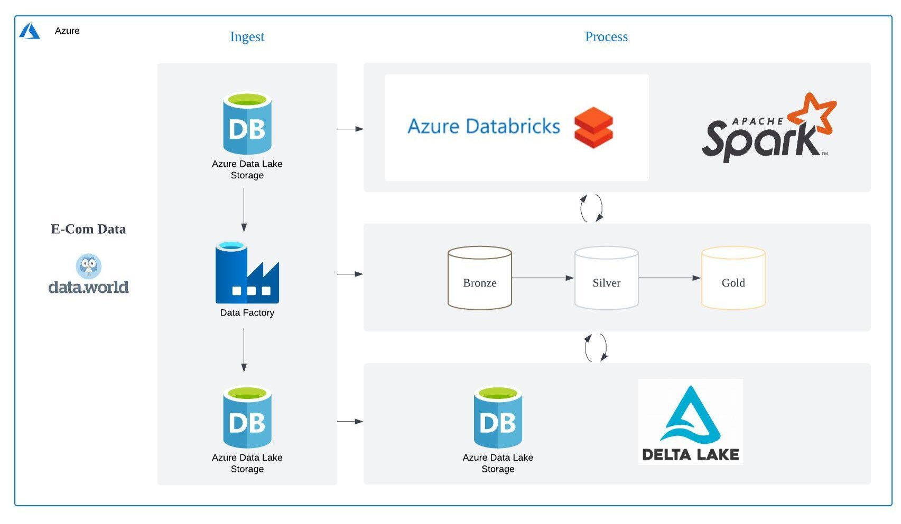

# Ecommerce Data Pipeline

The project involves building a data pipeline that automatically collects, processes, and stores data from the ecommerce platform. This includes data about users, sellers, buyers, and countries. The data will be extracted, transformed, and loaded into a database for analysis using the **medallion architecture**, which consists of **bronze**, **silver**, and **gold** layers. In the **bronze** layer, raw data is stored; in the **silver** layer, data is cleaned and transformed; and in the **gold** layer, the data is fully optimized for reporting and advanced analytics.

### **Objectives:**

1. **Daily Data Collection**: Automatically collect data from the ecommerce platform daily, including information on users, sellers, buyers, and transactions.
2. **Buyer-Seller Insights**: Track the activities of buyers and sellers to understand trends in sales, user behavior, and store performance.
3. **Geographic Analysis**: Analyze the distribution of users, sellers, and buyers across different countries to identify key markets.

### **Future Goals:**

- **User Behavior Analysis**: Track and analyze user behavior to identify purchasing trends, popular product categories, and buyer preferences.
- **Seller Performance**: Gain insights into top-performing sellers, product popularity, and factors influencing sales growth.
- **Market Expansion Insights**: Analyze country-level data to help identify opportunities for market expansion and growth in underperforming regions.

## Architecture Diagram

The architecture follows the medallion method where raw data will be placed on bronze, and the pipeline will automatically run to do transformations and place the desired output on the silver and gold layer.

## Technology Used:

1. Programming Language - Python, PySpark
2. Scripting Language - SQL
3. Microsoft Azure
    - Azure Data Lake Storage
    - Azure Data Factory
    - Azure Databricks

## Dataset Used

Using Ecommerce  C2C fashion store data from Data World website: 

https://data.world/jfreex/e-commerce-users-of-a-french-c2c-fashion-store

## Documentation
See how I documented my process on building this pipeline here: https://skinny-key-516.notion.site/E-commerce-Data-Pipeline-afd81994c42c4763b91b0637f8972dcc?pvs=4
